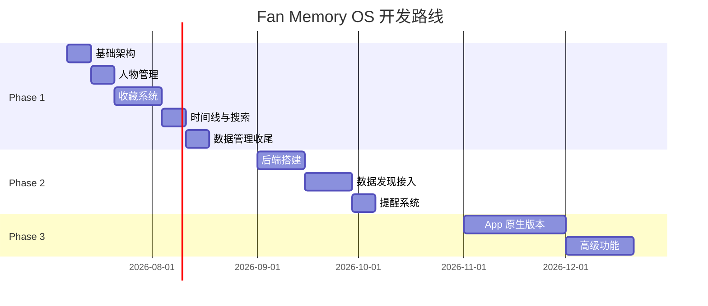

# 分阶段开发计划

## Phase 1：本地收藏 MVP

**目标：** 一个能用的本地追星资料库

**周期估算：** 4-6 周

### 任务分解

#### Sprint 1：基础架构（第1周）
- [ ] uni-app 项目初始化
- [ ] 数据模型定义（TypeScript 接口）
- [ ] 本地存储服务（StorageService）
- [ ] 项目路由配置

#### Sprint 2：人物管理（第2周）
- [ ] 添加/编辑明星页面
- [ ] 添加/编辑团队页面
- [ ] 别名/关键词管理
- [ ] 明星列表/主页 UI

#### Sprint 3：收藏系统（第3-4周）
- [ ] 收藏添加页面（粘贴链接）
- [ ] 平台自动识别（URL 解析）
- [ ] 收藏卡片组件
- [ ] 收藏库列表/网格视图
- [ ] 去重引擎
- [ ] 已看/未看切换

#### Sprint 4：时间线与搜索（第5周）
- [ ] 时间线页面
- [ ] 全局搜索
- [ ] 多维度筛选
- [ ] 忽略/屏蔽功能

#### Sprint 5：数据管理与收尾（第6周）
- [ ] JSON 导出
- [ ] JSON 导入
- [ ] 数据校验
- [ ] 设置页面
- [ ] 数据统计

### 不包含（明确不做）

- ❌ 视频/音乐下载
- ❌ AI 分析/自动标签
- ❌ 自动发现（Phase 2）
- ❌ 推送通知（Phase 2）
- ❌ 后端服务（Phase 2）
- ❌ 多端同步（Phase 3）

---

## Phase 2：轻量自动发现提醒

**目标：** 系统定期检查公开更新，发现新内容

**依赖：** 轻量后端（Node.js / Python FastAPI）

### 新增功能

- [ ] 关键词定时搜索
- [ ] 官方账号页检查
- [ ] 作品页更新检查
- [ ] 音乐人主页检查
- [ ] 新内容去重入库
- [ ] 提醒生成与推送
- [ ] 追踪源管理 UI
- [ ] 提醒中心 UI

### 后端技术选项

| 方案 | 优点 | 缺点 |
|------|------|------|
| Node.js + Cron | 前端团队熟悉 | 需要服务器 |
| Python FastAPI | 数据处理方便 | 需要服务器 |
| 云函数（SCF/FC） | 免运维 | 有配额限制 |

### 数据源接入计划

1. **RSSHub** — 作为统一内容发现入口
2. **微博/B站 API** — 官方 API（如有）
3. **页面解析** — 非结构化数据提取

---

## Phase 3：App 增强版

**目标：** 提升长期使用体验

**依赖：** 原生 App 开发能力

### 新增功能

- [ ] 系统分享接入（Share Sheet）
- [ ] 截图 OCR 自动识别
- [ ] SQLite 本地数据库
- [ ] 本地推送通知
- [ ] 日历视图
- [ ] 多设备同步（iCloud/WebDAV）
- [ ] 加密备份
- [ ] 规则化偏好过滤

### 技术选项

| 方案 | 优点 |
|------|------|
| uni-app 原生插件 | 复用现有代码 |
| Flutter | 跨平台性能好 |
| Swift/SwiftUI + Kotlin | 原生体验最佳 |

---

## 里程碑

